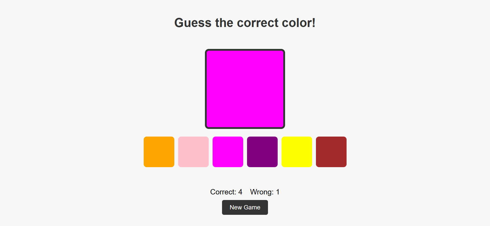

# Stage {1} - {COLOR GAME}

**📌 Task Description:**  
Basically, this task is just to create a color guessing game for users to play. So the user is been given a set of colors to choose from, One point for guessing a color correctly and Zero when you fail to guess correctly

**🚀 [Live Preview:](https://stage-one-ebon.vercel.app/)**

**🛠️ Technologies Used:**

- HTML, CSS, JavaScript

**📸 Screenshot:**  
 
