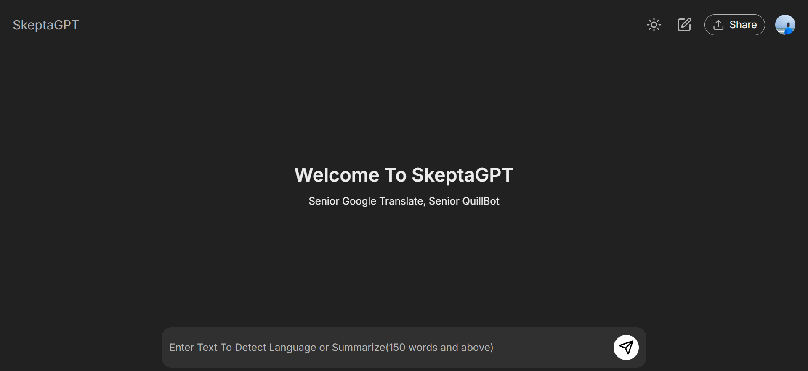

# Stage {3} - {SkeptaGPT}

**📌 Task Description:**  
Skepta GPT is your go to chatgpt for language translation. NB: Works on only Chrome Browser as its fully Chrome Browser APIs been used as the task required.

**🚀 [Live Preview:](https://stage-three-three.vercel.app/)**

**🛠️ Technologies Used:**

- HTML, CSS, JavaScript
- React, Tailwind

**📸 Screenshot:**  
 

**🔍 Features:**

- ✅ Users can input text and the system detects the language which the text is written
- ✅ System is able to translate texts from one language to another
- ✅ Dark Theme / Light Theme features and abilit to save data to local storage

**📜 Lessons Learned:**  
Learnt a lot about Chrome Browser in-built APIs and how to implement them
