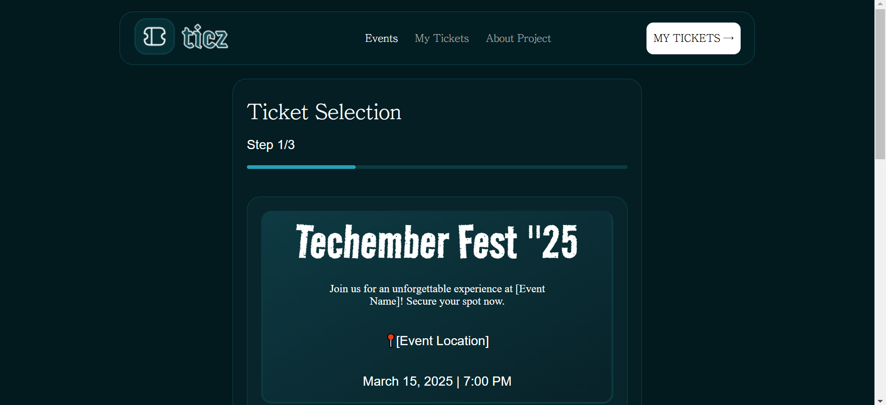

# Stage {2} - {CONFERENCE TICKET GENERATOR}

**📌 Task Description:**  
Succesfull implementation of a pixel perfect UI design of a conference ticket generator system with all functionalites working

**🚀 [Live Preview:](https://stage-two.vercel.app/)**

**🛠️ Technologies Used:**

- HTML, CSS, JavaScript
- React

**📸 Screenshot:**  
 

**🔍 Features:**

- ✅ Users are able to Input their details for conference and upload their Picture
- ✅ A ticket with a qr code is been generated for them
- ✅ Users can download the generated ticket

**📜 Lessons Learned:**  
Learnt about Cloudinary for the first time and Implemented It
